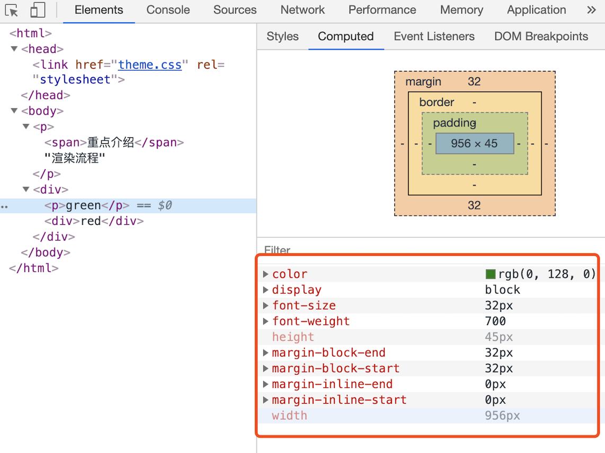

## 1 chrome打开一个tab页面有几个进程？

### 1单进程浏览器
我们知道js是单线程的语言，一次只能做一件事。早期的浏览器也是单进程浏览器，但是这样有很多问题，主要是3个方面：不稳定、不流畅、不安全。
 * 不稳定：浏览器中经常会装很多插件，而插件的开发很多都是个人开发的，有很多的隐患在，所以有时候会崩溃，因为是单进程，插件崩溃了，整个页面就崩溃了。 
 * 不流畅：比如某个页面js代码中有一块死循环了，那么就会一直执行这个代码块，另外地方的代码都没有机会执行了，另外页面也会受到影响。另外运行一个复杂点的页面再关闭页面，会存在内存不能完全回收的情况，这样导致的问题是使用时间越长，内存占用越高，浏览器会变得越慢，即使没有再打开那个有内存泄露问题的网页，但是浏览器仍然会越用越卡。 
 * 不安全：一些恶意脚本会访问计算机本地的文件，有时候甚至篡改文件，因此有很大的安全隐患。

### 2多进程浏览器

* 浏览器进程。主要负责界面显示、用户交互、子进程管理，同时提供存储等功能。
* 渲染进程。核心任务是将 HTML、CSS 和 JavaScript 转换为用户可以与之交互的网页，排版引擎 Blink 和 JavaScript 引擎 V8 都是运行在该进程中，默认情况下，Chrome 会为每个 Tab 标签创建一个渲染进程。出于安全考虑，渲染进程都是运行在沙箱模式下。因为渲染进程所有的内容都是通过网络获取的，会存在一些恶意代码利用浏览器漏洞对系统进行攻击，所以运行在渲染进程里面的代码是不被信任的。  

* GPU 进程。其实，Chrome 刚开始发布的时候是没有 GPU 进程的。而 GPU 的使用初衷是为了实现 3D CSS 的效果，只是随后网页、Chrome 的 UI 界面都选择采用 GPU 来绘制，这使得 GPU 成为浏览器普遍的需求。最后，Chrome 在其多进程架构上也引入了 GPU 进程。  
* 网络进程。面向渲染进程和浏览器进程等提供网络下载功能。
* 插件进程。主要是负责插件的运行，因插件易崩溃，所以需要通过插件进程来隔离，以保证插件进程崩溃不会对浏览器和页面造成影响。

多进程浏览器是如何解决了之前的问题的。

1. 不稳定的问题。由于进程是相互隔离的，所以当一个页面或者插件崩溃时，影响到的仅仅是当前的页面进程或者插件进程，并不会影响到浏览器和其他页面，这就完美地解决了页面或者插件的崩溃会导致整个浏览器崩溃，也就是不稳定的问题。

2. 不流畅的问题是如何解决的。同样，JavaScript 也是运行在渲染进程中的，所以即使 JavaScript 阻塞了渲染进程，影响到的也只是当前的渲染页面，而并不会影响浏览器和其他页面，因为其他页面的脚本是运行在它们自己的渲染进程中的。所以当我们再在 Chrome 中运行上面那个死循环的脚本时，没有响应的仅仅是当前的页面。对于内存泄漏的解决方法那就更简单了，因为当关闭一个页面时，整个渲染进程也会被关闭，之后该进程所占用的内存都会被系统回收，这样就解决了浏览器页面的内存泄漏问题。

3. 安全问题。采用多进程架构的额外好处是可以使用安全沙箱，你可以把沙箱看成是操作系统给进程上了一把锁，沙箱里面的程序可以运行，但是不能在你的硬盘上写入任何数据，也不能在敏感位置读取任何数据，例如你的文档和桌面。Chrome 把插件进程和渲染进程锁在沙箱里面，这样即使在渲染进程或者插件进程里面执行了恶意程序，恶意程序也无法突破沙箱去获取系统权限。

## 2经典问题-从输入 URL 到页面展示，这中间发生了什么？ 

关于这道问题，大家都有所听闻，但是大多数人可能回答其中部分零散的知识点，并不能将这些知识点串联成线，或者问的细致一点，有些问题可能就不太清楚了，例如：

1渲染流水线是怎么样的？
2合成层的“层”与层叠上下文的“层”是一个东西吗？
3层爆炸、层压缩是什么？
4都说要减少回流、重绘，怎样利用硬件加速做到？

#### 导航过程
   1. 用户输入url并回车    
   2. 浏览器进程检查url，组装协议，构成完整的url。 触发beforeunload钩子    
   3. 浏览器进程通过进程间通信（IPC）把url请求发送给网络进程    
   4. 网络进程接收到url请求后检查本地缓存是否缓存了该请求资源，如果有则将该资源返回给浏览器进程   
   5. 如果没有，网络进程向web服务器发起http请求（网络请求），请求流程如下：        5.1 进行DNS解析，获取服务器ip地址        5.2 利用ip地址和服务器建立tcp连接        5.3 构建请求头信息        5.4 发送请求头信息        5.5 服务器响应后，网络进程接收响应头和响应信息，并解析响应内容-   
   6. 网络进程解析响应流程；        6.1 检查状态码，如果是301/302，则需要重定向，从Location自动中读取地址，重新进行第4步      如果是200，则继续处理请求。        6.2 200响应处理：            检查响应类型Content-Type，如果是字节流类型，则将该请求提交给下载管理器，该导航流程结束，不再进行            后续的渲染，如果是html则通知浏览器进程准备渲染进程准备进行渲染。    7，准备渲染进程       
   7. 浏览器进程检查当前url是否和之前打开的页面是否为同一站点（根域名（例如，baoxiaohe.com）加上协议都相同），如果相同，则复用原来的渲染进程，如果不同，则开启新的渲染进程   
   8. 传输数据、更新状态        8.1 渲染进程准备好后，浏览器向渲染进程发起“提交文档”的消息，渲染进程接收到消息和网络进程建立传输数据的“管道”        8.2 渲染进程接收完数据后，向浏览器发送“确认提交”        8.3 浏览器进程接收到确认消息后更新浏览器界面状态：安全、地址栏url、前进后退的历史状态、更新web页面   (这也就解释了为什么在浏览器的地址栏里面输入了一个地址后，之前的页面没有立马消失，而是要加载一会儿才会更新页面。)

#### 渲染过程
页面结构：
 

由于渲染机制过于复杂，所以渲染模块在执行过程中会被划分为很多子阶段，输入的 HTML 经过这些子阶段，最后输出像素。我们把这样的一个处理流程叫做渲染流水线，其大致流程如下图所示：
 
按照渲染的时间顺序，流水线可分为如下几个子阶段：
构建 DOM 树、样式计算、布局阶段、分层、绘制、分块、光栅化和合成。

每个阶段的过程中需要关注的是
* 开始每个子阶段都有其输入的内容；
* 然后每个子阶段有其处理过程；
* 最终每个子阶段会生成输出内容。
##### 1构建 DOM 树
为什么要构建 DOM 树呢？这是因为浏览器无法直接理解和使用 HTML，所以需要将 HTML 转换为浏览器能够理解的结构——DOM 树。
 

 在Chrome 的控制台也能看到dom树，例如输入document。
 你可以看到，DOM 和 HTML 内容几乎是一样的，但是和 HTML 不同的是，DOM 是保存在内存中树状结构，可以通过 JavaScript 来查询或修改其内容。

##### 2样式计算
样式计算的目的是为了计算出 DOM 节点中每个元素的具体样式，这个阶段大体可分为三步来完成。
1. 把 CSS 转换为浏览器能够理解的结构
CSS 样式来源主要有三种：
> 1 通过 link 引用的外部 CSS 文件 
> 2 style> 标记内的 CSS 
> 3 元素的 style 属性内嵌的 CSS
和 HTML 文件一样，浏览器也是无法直接理解这些纯文本的 CSS 样式，所以当渲染引擎接收到 CSS 文本时，会执行一个转换操作，将 CSS 文本转换为浏览器可以理解的结构——styleSheets。

可以在 Chrome 控制台中查看其结构，只需要在控制台中输入 document.styleSheets

渲染引擎会把获取到的 CSS 文本全部转换为 styleSheets 结构中的数据，并且该结构**同时具备了查询和修改功能，这会为后面的样式操作提供基础**

2. 转换样式表中的属性值，使其标准化

如 2em、blue、bold，这些类型数值不容易被渲染引擎理解，所以需要将所有值转换为渲染引擎容易理解的、标准化的计算值，这个过程就是属性值标准化。
 

 3. 计算出 DOM 树中每个节点的具体样式
这就涉及到 CSS 的继承规则和层叠规则了。
首先是继承，部分css样式具有继承的特性，子节点会继承了父节点样式。
 
 

第二个规则是样式层叠。层叠是 CSS 的一个基本特征，它是一个定义了如何合并来自多个源的属性值的算法。它在 CSS 处于核心地位，CSS 的全称“层叠样式表”正是强调了这一点。

之，样式计算阶段的目的是为了计算出 DOM 节点中每个元素的具体样式，在计算过程中需要遵守 CSS 的继承和层叠两个规则。这个阶段最终输出的内容是每个 DOM 节点的样式，并被保存在 ComputedStyle 的结构内。
 

##### 3布局阶段
现在，我们有 DOM 树和 DOM 树中元素的样式，但这还不足以显示页面，因为我们还不知道 DOM 元素的几何位置信息。那么接下来就需要计算出 DOM 树中可见元素的几何位置，我们把这个计算过程叫做布局。Chrome 在布局阶段需要完成两个任务：创建布局树和布局计算。

 

计算并记录布局树节点的坐标位置。

##### 4分层

因为页面中有很多复杂的效果，如一些复杂的 3D 变换、页面滚动，或者使用 z-indexing 做 z 轴排序等，为了更加方便地实现这些效果，渲染引擎还需要为特定的节点生成专用的图层，并生成一棵对应的图层树（LayerTree）。如果你熟悉 PS，相信你会很容易理解图层的概念，正是这些图层叠加在一起构成了最终的页面图像。
浏览器的页面实际上被分成了很多图层，这些图层叠加后合成了最终的页面。

##### 5绘制
渲染引擎实现图层的绘制与之类似，会把一个图层的绘制拆分成很多小的绘制指令，然后再把这些指令按照顺序组成一个待绘制列表.

绘制列表中的指令其实非常简单，就是让其执行一个简单的绘制操作，比如绘制粉色矩形或者黑色的线等。而绘制一个元素通常需要好几条绘制指令，因为每个元素的背景、前景、边框都需要单独的指令去绘制。所以在图层绘制阶段，输出的内容就是这些待绘制列表。

你也可以打开“开发者工具”的“Layers”标签，选择“document”层，来实际体验下绘制列表

栅格化（raster）

操作绘制列表只是用来记录绘制顺序和绘制指令的列表，而实际上绘制操作是由渲染引擎中的合成线程来完成的。你可以结合下图来看下渲染主线程和合成线程之间的关系：

如上图所示，当图层的绘制列表准备好之后，主线程会把该绘制列表提交（commit）给合成线程，那么接下来合成线程是怎么工作的呢？

通常一个页面可能很大，但是用户只能看到其中的一部分，我们把用户可以看到的这个部分叫做视口（viewport）。在有些情况下，有的图层可以很大，比如有的页面你使用滚动条要滚动好久才能滚动到底部，但是通过视口，用户只能看到页面的很小一部分，所以在这种情况下，要绘制出所有图层内容的话，就会产生太大的开销，而且也没有必要。基于这个原因，合成线程会将图层划分为图块（tile）这些图块的大小通常是 256x256 或者 512x512，如下图所示

合成线程会按照视口附近的图块来优先生成位图，实际生成位图的操作是由栅格化来执行的。所谓栅格化，是指将图块转换为位图。而图块是栅格化执行的最小单位。渲染进程维护了一个栅格化的线程池，所有的图块栅格化都是在线程池内执行的，运行方式如下图所示：
 

通常，栅格化过程都会使用 GPU 来加速生成，使用 GPU 生成位图的过程叫快速栅格化，或者 GPU 栅格化，生成的位图被保存在 GPU 内存中。相信你还记得，GPU 操作是运行在 GPU 进程中，如果栅格化操作使用了 GPU，那么最终生成位图的操作是在 GPU 中完成的，这就涉及到了跨进程操作。
从图中可以看出，渲染进程把生成图块的指令发送给 GPU，然后在 GPU 中执行生成图块的位图，并保存在 GPU 的内存中。
##### 合成和显示
一旦所有图块都被光栅化，合成线程就会生成一个绘制图块的命令——“DrawQuad”，然后将该命令提交给浏览器进程。浏览器进程里面有一个叫 viz 的组件，用来接收合成线程发过来的 DrawQuad 命令，然后根据 DrawQuad 命令，将其页面内容绘制到显存中，最后再将内存显示在屏幕上。到这里，经过这一系列的阶段，编写好的 HTML、CSS、JavaScript 等文件，经过浏览器就会显示出漂亮的页面了。

<!-- 1. 渲染进程将 HTML 内容转换为能够读懂的 DOM 树结构。                
2. 渲染引擎将 CSS 样式表转化为浏览器可以理解的 styleSheets，然后计算出 DOM树中每个节点的样式(包含css继承规则和层叠规则的处理)  
3. 创建布局树，并计算元素的布局信息、节点的坐标位置。  
4. 对布局树进行分层，并生成分层树。渲染引擎需要为特定的节点生成专用的图层，并生成一棵对应的图层树如果一个节点没有对应的层，那么这个节点就从属于父节点的图层。满足2个条件的元素将提升为单独的图层：一点，拥有层叠上下文属性的元素会被提升为单独的一层。（明确定位属性的元素、定义透明属性的元素、使用CSS 滤镜的元素等，都拥有层叠上下文属性。）第二点，需要剪裁（clip）的地方也会被创建为图层。 （例overflow）  
5. 为每个图层生成绘制列表，（会把一个图层的绘制拆分成很多小的绘制指令，然后再把这些指令按照顺序组一个待绘制列表，比如绘制蓝色背景；在中间绘制一个红色的圆；再在圆上绘制绿色三角形。）并将其提交到合线程。  
6. 合成线程将图层分成图块（图块是栅格化执行的最小单位，通常就是256x256 或者 512x512的一块区域）图块按照绘制列表中的指令生成，并在光栅化线程池中进行栅格化处理。所谓栅格化，是指将图块转换为位图。合成线程会按照视口附近的图块来优先生成位图，实际生成位图的操作是由栅格化来执行的。
7. 一旦所有图块都被光栅化，合成线程发送绘制图块命令 DrawQuad 给浏览器进程。  
8. 浏览器进程根据 DrawQuad 消息生成页面绘制到内存中，最后再将内存显示在屏幕上。 -->

