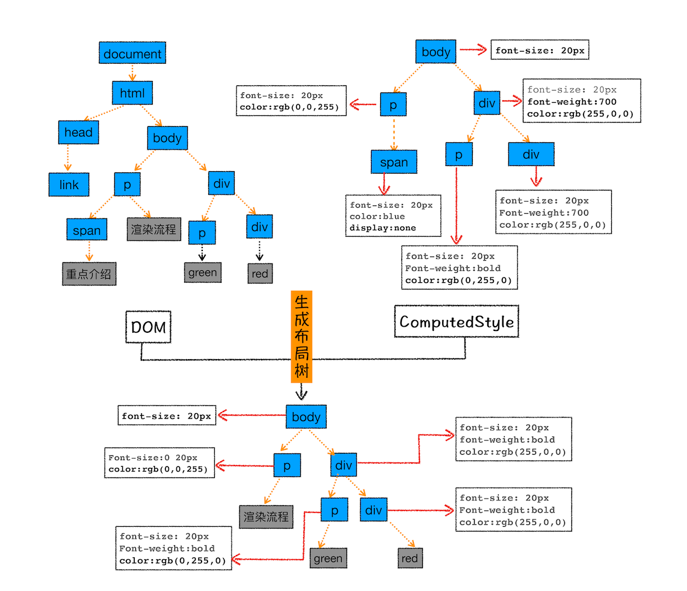
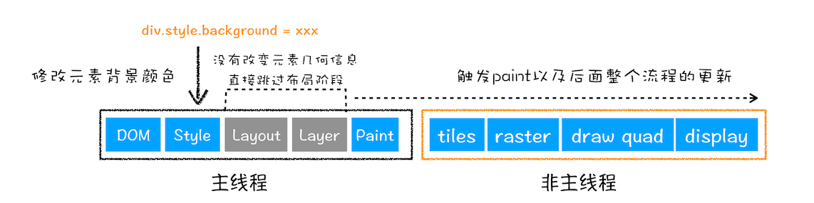

# 浅谈浏览器渲染工作原理

 
<br/>

## 导语
我们每个人每天都在使用浏览器，但是很少有人关注他是如何运行的。这里将带领大家探究浏览器渲染原理，了解被大多数开发忽视的浏览器渲染工作原理。了解这些知识呢，不一定对写代码有多大的提升，但是可以在遇到一些疑难杂症问题的时候，思考问题有一个更开阔的视野和角度。

<br/>
<br/>
<br/>

## 1 chrome打开一个tab页面有几个进程？
<br/>

### 1单进程浏览器
我们知道js是单线程的语言，一次只能做一件事。早期的浏览器也是单进程浏览器，但是这样有很多问题，主要是3个方面：不稳定、不流畅、不安全。
 * 不稳定：浏览器中经常会装很多插件，而插件的开发很多都是个人开发的，有很多的隐患在，所以有时候会崩溃，因为是单进程，插件崩溃了，整个页面就崩溃了。 
 * 不流畅：比如某个页面js代码中有一块死循环了，那么就会一直执行这个代码块，另外地方的代码都没有机会执行了，另外页面也会受到影响。另外运行一个复杂点的页面再关闭页面，会存在内存不能完全回收的情况，这样导致的问题是使用时间越长，内存占用越高，浏览器会变得越慢，即使没有再打开那个有内存泄露问题的网页，但是浏览器仍然会越用越卡。 
 * 不安全：一些恶意脚本会访问计算机本地的文件，有时候甚至篡改文件，因此有很大的安全隐患。

### 2多进程浏览器

* 浏览器进程。主要负责界面显示、用户交互、子进程管理，同时提供存储等功能。
* 渲染进程。核心任务是将 HTML、CSS 和 JavaScript 转换为用户可以与之交互的网页，排版引擎 Blink 和 JavaScript 引擎 V8 都是运行在该进程中，默认情况下，Chrome 会为每个 Tab 标签创建一个渲染进程。出于安全考虑，渲染进程都是运行在沙箱模式下。因为渲染进程所有的内容都是通过网络获取的，会存在一些恶意代码利用浏览器漏洞对系统进行攻击，所以运行在渲染进程里面的代码是不被信任的。  

* GPU 进程。其实，Chrome 刚开始发布的时候是没有 GPU 进程的。而 GPU 的使用初衷是为了实现 3D CSS 的效果，只是随后网页、Chrome 的 UI 界面都选择采用 GPU 来绘制，这使得 GPU 成为浏览器普遍的需求。最后，Chrome 在其多进程架构上也引入了 GPU 进程。  
* 网络进程。面向渲染进程和浏览器进程等提供网络下载功能。
* 插件进程。主要是负责插件的运行，因插件易崩溃，所以需要通过插件进程来隔离。

多进程浏览器是如何解决了之前的问题的。

1. 不稳定的问题。由于进程是**相互隔离**的，所以当一个页面或者插件崩溃时，影响到的仅仅是当前的页面进程或者插件进程，并不会影响到浏览器和其他页面。

2. 不流畅的问题是如何解决的。同样，JavaScript 也是运行在渲染进程中的，所以即使 JavaScript 阻塞了渲染进程，影响到的也只是当前的渲染页面，而并不会影响浏览器和其他页面，因为其他页面的脚本是运行在它们**自己的渲染进程中**的。对于内存泄漏的解决方法那就更简单了，因为当关闭一个页面时，整个渲染进程也会被关闭，之后该进程所占用的内存都会被系统**回收**。

3. 安全问题。采用多进程架构的额外好处是可以使用**安全沙箱**，你可以把沙箱看成是操作系统给进程上了一把锁，沙箱里面的程序可以运行，但是不能在你的硬盘上写入任何数据，也不能在敏感位置读取任何数据，例如你的文档和桌面。Chrome 把插件进程和渲染进程锁在沙箱里面，这样即使在渲染进程或者插件进程里面执行了恶意程序，恶意程序也无法突破沙箱去获取系统权限。

## 2经典问题-从输入 URL 到页面展示，这中间发生了什么？ 

关于这道问题，大家都有所听闻，但是大多数人可能回答其中部分零散的知识点，并不能将这些知识点串联成线，或者问的细致一点，有些问题可能就不太清楚了，例如：

1渲染流水线是怎么样的？
2合成层的“层”与层叠上下文的“层”是一个东西吗？
3层爆炸、层压缩是什么？
4都说要减少回流、重绘，怎样利用硬件加速做到？


#### 导航过程
   1. 用户输入url并回车    
   2. 浏览器进程检查url，组装协议，构成完整的url。 触发beforeunload钩子    
   3. 浏览器进程通过进程间通信（IPC）把url请求发送给网络进程    
   4. 网络进程接收到url请求后检查本地缓存是否缓存了该请求资源，如果有则将该资源返回给浏览器进程   
   5. 如果没有，网络进程向web服务器发起http请求（网络请求），请求流程如下：        5.1 进行DNS解析，获取服务器ip地址        5.2 利用ip地址和服务器建立tcp连接        5.3 构建请求头信息        5.4 发送请求头信息        5.5 服务器响应后，网络进程接收响应头和响应信息，并解析响应内容-   
   6. 网络进程解析响应流程；        6.1 检查状态码，如果是301/302，则需要重定向，从Location自动中读取地址，重新进行第4步      如果是200，则继续处理请求。        6.2 200响应处理：            检查响应类型Content-Type，如果是字节流类型，则将该请求提交给下载管理器，该导航流程结束，不再进行            后续的渲染，如果是html则通知浏览器进程准备渲染进程准备进行渲染。    7，准备渲染进程       
   > Content-Type标头告诉客户端实际返回的内容的类型  Content-Disposition 是 MIME 协议的扩展，指示回复的内容该以何种形式展示 (attachment)

   7. 浏览器进程检查当前url是否和之前打开的页面是否为同一站点（根域名（例如，baoxiaohe.com）加上协议都相同），如果相同，则复用原来的渲染进程，如果不同，则开启新的渲染进程   
   8. 传输数据、更新状态        8.1 渲染进程准备好后，浏览器向渲染进程发起“提交文档”的消息，渲染进程接收到消息和网络进程建立传输数据的“管道”        8.2 渲染进程接收完数据后，向浏览器发送“确认提交”        8.3 浏览器进程接收到确认消息后更新浏览器界面状态：安全、地址栏url、前进后退的历史状态、更新web页面   (这也就解释了为什么在浏览器的地址栏里面输入了一个地址后，之前的页面没有立马消失，而是要加载一会儿才会更新页面。)
##### 多个页面会同时运行在一个渲染进程中？

Chrome 的默认策略是，每个标签对应一个渲染进程。但如果从一个页面打开了另一个新页面，而新页面和当前页面属于同一站点的话，那么新页面会复用父页面的渲染进程。官方把这个默认策略叫 process-per-site-instance。

> 同一站点（same-site）。具体地讲，我们将“同一站点”定义为根域名（例如，geekbang.org）加上协议

总结来说，打开一个新页面采用的渲染进程策略就是：
* 通常情况下，打开新的页面都会使用单独的渲染进程；
* 如果从 A 页面打开 B 页面，且 A 和 B 都属于同一站点的话，那么 B 页面复用 A 页面的渲染进程；如果是其他情况，浏览器进程则会为 B 创建一个新的渲染进程。
##### 站点隔离（Site Isolation）
所谓站点隔离是指 Chrome 将同一站点（包含了相同根域名和相同协议的地址）中相互关联的页面放到同一个渲染进程中执行。

最开始 Chrome 划分渲染进程是以标签页为单位，也就是说整个标签页会被划分给某个渲染进程。但是，按照标签页划分渲染进程存在一些问题，原因就是一个标签页中可能包含了多个 iframe，而这些 iframe 又有可能来自于不同的站点，这就导致了多个不同站点中的内容通过 iframe 同时运行在同一个渲染进程中。

比如一个网站有ABC三个iframe，其中a Iframe存在漏洞问题或者恶意程序，但是此时他们在一个渲染进程中，就有可能会对其他网站造成影响。因为沙箱隔离当前情况下只针对渲染进程，而他们却都在一个渲染进程下。

实现了站点隔离，就可以将恶意的 iframe 隔离在恶意进程内部，使得它无法继续访问其他 iframe 进程的内容，因此也就无法攻击其他站点了。


#### 渲染过程
页面结构：
 

由于渲染机制过于复杂，所以渲染模块在执行过程中会被划分为很多子阶段，输入的 HTML 经过这些子阶段，最后输出像素。我们把这样的一个处理流程叫做渲染流水线，其大致流程如下图所示：
 
按照渲染的时间顺序，流水线可分为如下几个子阶段：
构建 DOM 树、样式计算、布局阶段、分层、绘制、分块、光栅化和合成。

每个阶段的过程中需要关注的是
* 开始每个子阶段都有其输入的内容；
* 然后每个子阶段有其处理过程；
* 最终每个子阶段会生成输出内容。
##### 1构建 DOM 树
为什么要构建 DOM 树呢？这是因为浏览器无法直接理解和使用 HTML，所以需要将 HTML 转换为浏览器能够理解的结构——DOM 树。
 

 在Chrome 的控制台也能看到dom树，例如输入document。
 你可以看到，DOM 和 HTML 内容几乎是一样的，但是和 HTML 不同的是，DOM 是保存在内存中树状结构，可以通过 JavaScript 来查询或修改其内容。

##### 2样式计算
样式计算的目的是为了计算出 DOM 节点中每个元素的具体样式，这个阶段大体可分为三步来完成。
1. 把 CSS 转换为浏览器能够理解的结构
CSS 样式来源主要有三种：
> 1 通过 link 引用的外部 CSS 文件 
> 2 style> 标记内的 CSS 
> 3 元素的 style 属性内嵌的 CSS
和 HTML 文件一样，浏览器也是无法直接理解这些纯文本的 CSS 样式，所以当渲染引擎接收到 CSS 文本时，会执行一个转换操作，将 CSS 文本转换为浏览器可以理解的结构——styleSheets。

可以在 Chrome 控制台中查看其结构，只需要在控制台中输入 document.styleSheets

渲染引擎会把获取到的 CSS 文本全部转换为 styleSheets 结构中的数据，并且该结构**同时具备了查询和修改功能，这会为后面的样式操作提供基础**

2. 转换样式表中的属性值，使其标准化

如 2em、blue、bold，这些类型数值不容易被渲染引擎理解，所以需要将所有值转换为渲染引擎容易理解的、标准化的计算值，这个过程就是属性值标准化。
 

 3. 计算出 DOM 树中每个节点的具体样式
这就涉及到 CSS 的继承规则和层叠规则了。
首先是继承，部分css样式具有继承的特性，子节点会继承了父节点样式。
 
 

第二个规则是样式层叠。层叠是 CSS 的一个基本特征，它是一个定义了如何合并来自多个源的属性值的算法。它在 CSS 处于核心地位，CSS 的全称“层叠样式表”正是强调了这一点。

之，样式计算阶段的目的是为了计算出 DOM 节点中每个元素的具体样式，在计算过程中需要遵守 CSS 的继承和层叠两个规则。这个阶段最终输出的内容是每个 DOM 节点的样式，并被保存在 ComputedStyle 的结构内。
 


##### 3布局阶段
现在，我们有 DOM 树和 DOM 树中元素的样式，但这还不足以显示页面，因为我们还不知道 DOM 元素的几何位置信息。那么接下来就需要计算出 DOM 树中可见元素的几何位置，我们把这个计算过程叫做布局。Chrome 在布局阶段需要完成两个任务：创建布局树和布局计算。

 

计算并记录布局树节点的坐标位置。


##### 4分层

因为页面中有很多复杂的效果，如一些复杂的 3D 变换、页面滚动，或者使用 z-indexing 做 z 轴排序等，为了更加方便地实现这些效果，渲染引擎还需要为特定的节点生成专用的图层，并生成一棵对应的图层树（LayerTree）。如果你熟悉 PS，相信你会很容易理解图层的概念，正是这些图层叠加在一起构成了最终的页面图像。
浏览器的页面实际上被分成了很多图层，这些图层叠加后合成了最终的页面。

######  渲染中的层

上面提到了渲染过程中会发生“图层分层”。浏览器中的层分为两种：“渲染层”和“合成层（也叫复合层）”。很多文章中还会提到一个概念叫“图形层”，其实可以把它当作合成层看待。

先直观的感受一下“层”，打开浏览器开发者工具的layers:


```
layers.html
```
可以看到AB元素都在最底下的图层中，元素C是单独的一层，元素D又是一层。


之前说过，浏览器中的层分两种，渲染层和合成层，在开发者工具看到的全部都是合成层。
那么，怎样生成一个渲染层，又怎样才能形成一个合成层呢？

###### 层叠上下文
**层叠上下文(概念)** 听起来比较抽象，我们假定用户正面向（浏览器）视窗或网页，而 HTML 元素沿着其相对于用户的一条虚构的 z 轴排开，层叠上下文就是对这些 HTML 元素的一个三维构想。在CSS规范中，每个盒模型的位置是三维的，分别是平面画布上的X轴，Y轴以及表示层叠的Z轴。一般情况下，元素在页面上沿X轴Y轴平铺，我们察觉不到它们在Z轴上的层叠关系。而一旦元素发生堆叠，这时就能发现某个元素可能覆盖了另一个元素或者被另一个元素覆盖。如果一个元素含有层叠上下文，(也就是说它是层叠上下文元素)，我们可以理解为这个元素在Z轴上就“高人一等”，最终表现就是它离屏幕观察者更近。

也可以理解为，**层叠上下文是html中某些元素的一个特殊属性，这个属性决定了他在空间的上下位置，而这个位置会影响到他们的渲染顺序。**


最大的层叠上下文就是由文档根元素——html形成的：它自身连同它的子元素就形成了一个最大的层叠上下文，也就是说，我们写的所有代码都是在根层叠上下文里的。
特性：

* 层叠上下文可以包含在其他层叠上下文中，并且一起创建一个层叠上下文的层级。（每个有z-index数值的元素也会连同它的子元素一起，生成一个小的层叠上下文，这个小层叠上下文和父级一样，拥有多个平面。）
* 每个层叠上下文都是自包含的：当一个元素的内容发生层叠后，该元素将被作为整体在父级层叠上下文中按顺序进行层叠。


只有明确指定了z-index的值（不是auto）的定位元素(定义了position且值非static)才会生产一个层叠上下文，在这个层叠上下文中，内部元素层级都在它之上，哪怕是负数。


**层叠等级（规则）**：
* 在同一个层叠上下文中，它描述定义的是该层叠上下文中的层叠上下文元素在Z轴上的上下顺序。
* 在其他普通元素中，它描述定义的是这些普通元素在Z轴上的上下顺序。

```
层级问题2.html
```
 
######  渲染层
渲染层的概念跟“层叠上下文”密切相关，简单来说，拥有z-index属性的定位元素会生成一个层叠上下文，一个生成层叠上下文的元素就生成了一个渲染层。


还是沿用上面的例子，BCD三个元素都是拥有z-index属性的定位元素（绝对定位），所以他们三个都形成了一个渲染层，加上document根元素形成的，一共是四个渲染层。（再强调一下，在开发者工具中看不到渲染层。）

形成渲染层的条件也就是形成层叠上下文的条件，有这几种情况：

1. document 元素
2. 拥有z-index属性的定位元素（position: relative|fixed|sticky|absolute）
3. 弹性布局的子项（父元素display:flex|inline-flex)，并且z-index不是auto时
4. opacity非1的元素
5. transform非none的元素
6. filter非none的元素
7. will-change = opacity | transform | filter
8. 此外需要剪裁的元素也会形成一个渲染层，也就是overflow不是visible的元素

###### 合成层
只有一些特殊的渲染层才会被提升为合成层，通常来说有这些情况：

1. document根元素
2. transform:3D变换：translate3d，translateZ；
3. will-change:opacity | transform | filter
4. 对 opacity | transform | fliter 应用了过渡和动画（transition/animation）
5. video、canvas、iframe
6. 可滚动溢出元素，scrollable overflow

可以看出，上面这些条件属于生成渲染层的“加强版”，也就是说形成合成层的条件要更苛刻。

还是用开头的例子，C元素就是命中条件1，使用了3D变换transform: translateZ(0)，于是被提升到一个单独的合成层。

但是D元素没有命中上面任何一条规则，却也是一个单独的合成层。因为还有一种情况——隐式合成。

######  隐式合成
当出现一个合成层后，层级顺序高于它的堆叠元素就会发生隐式合成。

我们给C、D元素设置层级，z-index分别是3和4；又在C元素上使用3D变换，提升成了合成层。此时，层级高于它的D元素就发生了隐式合成，也变成了一个合成层。

隐式合成出现的根本原是，元素发生了堆叠，浏览器为了保证最后的展示效果，不得不把层级顺序更高的元素拎出来盖在已有合成层上面。
######  层爆炸与层压缩
当页面内容非常多，层级复杂的时候，低层级的渲染层在某一时刻提升为合成层，那么此时改产生了很多预期外的合成层，——页面中所有 z-index 高于它的节点全部被提升，这些合成层都是相当消耗内存和GPU的，这个现象就是层爆炸。

解决思路：
1 代码层面控制，在会形成合成层的元素增加一个大的z-index属性，人为控制合成的排序，可以有效减少chrome创建不必要的合成层，提升渲染性能，移动端优化效果尤为明显。
2 部分浏览器层压缩机制(chrome94)，多个渲染层同一个合成层重叠时，会自动将他们压缩到一起，避免“层爆炸”带来的损耗。
```
layer2.html
```
当然，浏览器的自动的层压缩也不是万能的，有很多特定情况下，浏览器是无法进行层压缩的，比如设置里mask属性、video 元素等等，另外也和使用等浏览器有关(safari)
layer2.html


######  硬件加速
上面讲了这么多，在实际开发中有什么用呢？或者说，浏览器为什么要分层呢？答案是为了提升渲染效率，使用硬件加速加快渲染速度。就是给HTML元素加上某些CSS属性，比如3D变换，将其提升成一个合成层，独立渲染。

之所以叫硬件加速，就是因为合成层会交给GPU（显卡）去处理，比在主线程（CPU）上效率更高。

提升成合成层的元素发生回流、重绘都只影响这一层，渲染效率得到提升。

来看一个例子，使用animation改变B元素的宽度，通过开发者工具Layers中的“paint count”的可以看到页面绘制次数会一直在增加，能直观感受到页面发生了“重绘”。
```
layer3.html
```
可以注意到，重绘是发生在整个图层#document上的，也就是整个页面都要重绘。


给B元素加上will-change:transform开启硬件加速，让他提升成一个合成层，此时只有b元素在重绘


有得必有失，开启硬件加速后的合成层会交给GPU处理，当图层过多时，将会占用大量内存，尤其在移动端会造成卡顿，让优化适得其反。正确使用硬件加速就是在渲染效率和性能损耗之间找到一个平衡点，让页面渲染迅速不白屏，又流畅丝滑。

###### 重绘 回流
在CSS属性改变时，重渲染会分为“回流”、“重绘”和“直接合成”三种情况，分别对应从“布局定位”/“图层绘制”/“合成显示”开始，再走一遍上面的流程。

元素的CSS具体发生什么改变，则决定属于上面哪种情况：

1重绘：修改了一些不影响布局的属性，比如颜色；
 

2回流（又叫重排）：元素位置、大小发生变化导致其他节点联动，需要重新计算布局；
 

3直接合成：合成层的transform、opacity修改，只需要将多个图层再次合并，而后生成位图，最终展示到屏幕上；
 

宽度的变化，在页面绘制的过程中会不断的重排，但是我们上面提到还有中方式是直接合成，若此时我们变化的属性改为transform: scale(2); 会发现当前这个合成层，变成只绘制一次了。


###### 优化渲染性能
上面讲到了，利用硬件加速，可以把需要重排/重绘的元素单独拎出来，减少绘制的面积，除此之外，提升渲染性能还有这几个常见的方法：

1. 避免重排/重绘，直接进行合成，合成层的transform 和 opacity的修改都是直接进入合成阶段的；比如可以使用transform:translate代替left/top修改元素的位置；使用transform:scale代替宽度、高度的修改；
2. 注意隐式合成，给合成层一个较大的z-index值，虽然大部分浏览器已经实现了层压缩的能力，但是依旧有无法处理的情况，最好的办法就是一开始就避免层爆炸；
3. 减小合成层占用的内存，合成层的最大问题就是占用内存较多，而内存的占用和元素的尺寸是成正比的。如果要实现一个100X100的元素，可以给宽高都设置为10px，再使用transform:scale(10)放大10倍，这样占用的内存只有直接设置的1/100；

layer4.html
###### 小结

1. 硬件加速，它是一个很宽泛的计算机概念——把软件的工作交给特定的硬件，更高效的完成某项任务。对于前端来说，就是使用特定的CSS属性，把元素提升成合成层，交给GPU处理；
2. 合成层中的“层”可以被认为是真正物理上的层，浏览器把它独立出来，单独拿给GPU处理，而层叠上下文的“层”则是指渲染层，更像是一个概念上的层，一个合成层可以包含多个渲染层；
3. 层爆炸指的是大量元素意料之外被提升成合成层，即隐式合成；层压缩是浏览器对隐式合成的优化，chrome在这方面做到比较完善了；
4. 使用transform、opacity取代传统属性来实现一些动画，并把他们提升到一个单独的合成层，能跳过布局计算和重新绘制，直接合成，能避免不必要的回流、重绘；
##### 5绘制
渲染引擎实现图层的绘制与之类似，会把一个图层的绘制拆分成很多小的绘制指令，然后再把这些指令按照顺序组成一个待绘制列表.

绘制列表中的指令其实非常简单，就是让其执行一个简单的绘制操作，比如绘制粉色矩形或者黑色的线等。而绘制一个元素通常需要好几条绘制指令，因为每个元素的背景、前景、边框都需要单独的指令去绘制。所以在图层绘制阶段，输出的内容就是这些待绘制列表。

你也可以打开“开发者工具”的“Layers”标签，选择“document”层，来实际体验下绘制列表


操作绘制列表只是用来记录绘制顺序和绘制指令的列表，而实际上绘制操作是由渲染引擎中的合成线程来完成的。你可以结合下图来看下渲染主线程和合成线程之间的关系：

如上图所示，当图层的绘制列表准备好之后，主线程会把该绘制列表提交（commit）给合成线程，那么接下来合成线程是怎么工作的呢？
##### 6分块


通常一个页面可能很大，但是用户只能看到其中的一部分，我们把用户可以看到的这个部分叫做视口（viewport）。在有些情况下，有的图层可以很大，比如有的页面你使用滚动条要滚动好久才能滚动到底部，但是通过视口，用户只能看到页面的很小一部分，所以在这种情况下，要绘制出所有图层内容的话，就会产生太大的开销，而且也没有必要。基于这个原因，合成线程会将图层划分为图块（tile）

chrome 控制台 - 渲染-图层边框 可以看到图块区域

##### 7栅格化（raster）

合成线程会按照视口附近的图块来优先生成位图，实际生成位图的操作是由栅格化来执行的。此处栅格化，是指将图块转换为位图。而图块是栅格化执行的最小单位。渲染进程维护了一个栅格化的线程池，所有的图块栅格化都是在线程池内执行的，运行方式如下图所示：
 

通常，栅格化过程都会使用 GPU 来加速生成，使用 GPU 生成位图的过程叫快速栅格化，或者 GPU 栅格化，生成的位图被保存在 GPU 内存中。相信你还记得，GPU 操作是运行在 GPU 进程中，如果栅格化操作使用了 GPU，那么最终生成位图的操作是在 GPU 中完成的，这就涉及到了跨进程操作。
从图中可以看出，渲染进程把生成图块的指令发送给 GPU，然后在 GPU 中执行生成图块的位图，并保存在 GPU 的内存中。
##### 8合成和显示
一旦所有图块都被光栅化，合成线程就会生成一个绘制图块的命令——“DrawQuad”，然后将该命令提交给浏览器进程。浏览器进程接收到合成线程发过来的 DrawQuad 命令，然后根据 DrawQuad 命令，将其页面内容绘制到显存中，最后再显示在屏幕上。到这里，经过这一系列的阶段，编写好的 HTML、CSS、JavaScript 等文件，经过浏览器就会显示出漂亮的页面了。
 


